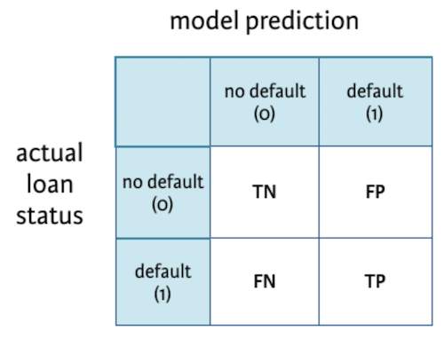

*Code File: Soon*

> **Task Background**  
> *Sebagai tugas akhir dari masa kontrakmu sebagai intern Data Scientist di ID/X Partners, kali ini kamu akan dilibatkan dalam projek dari sebuah lending company. Kamu akan berkolaborasi dengan berbagai departemen lain dalam projek ini untuk menyediakan solusi teknologi bagi company tersebut. Kamu diminta untuk membangun model yang dapat memprediksi credit risk menggunakan dataset yang disediakan oleh company yang terdiri dari data pinjaman yang diterima dan yang ditolak. Selain itu kamu juga perlu mempersiapkan media visual untuk mempresentasikan solusi ke klien. Pastikan media visual yang kamu buat jelas, mudah dibaca, dan komunikatif. Pengerjaan end-to-end solution ini dapat dilakukan di Programming Language pilihanmu dengan tetap mengacu kepada framework/methodology Data Science.*

**Lending Company**  
Perusahaan yang memiliki kegiatan pendanaan yang dilakukan oleh lembaga keuangan kepada perseroan. Dana yang diberikan biasanya berasal dari masyarakat yang menyimpan uangnya di lembaga keuangan tersebut. Kegiatan lending juga sering disebut loan atau kredit oleh masyarakat.

**Credit Risk**  
Risiko yang mungkin terjadi karena debitur gagal memenuhi kewajibannya dalam membayar hutangnya pada saat jatuh tempo pembayaran. hal ini bisa disebut sebagai pinjaman bermasalah atau Non-Performing Loan (NPL)

**Why Credit Risk Happen?**
* Besarnya eksposur kredit, Semakin besar pinjaman maka akan semakin besar juga eksposur kredit.
* Kualitas eksposur kredit, merupakan kemungkinan gagal bayar yang dinilai dari kualitas agunan yang diberikan debitur. Semakin rendah nilai jaminan tersebut, maka semakin rendah pula kualitas dari eksposur kredit tersebut. Hal ini berarti akan semakin tinggi risiko yang harus ditanggung.

**Credit Risk Negative Impact**
* Liquidity: Mengurangi kemampuan perusahaan dalam memenuhi kewajiban jangka pendek yang dimilikinya.
* Capital Adequacy: Mengurangi kecukupan modal dalam memberi pinjaman kepada debitur lain
* Net Intereset Margin: Berkurangnya kemampuan perusahaan dalam mengelola aktiva produktifnya
* Profitability: Mengurangi keuntungan yang didapatkan

**Risk Management**
* Penyaringan: Kegiatan menempatkan orang-orang terbaik untuk melakukan analisa dan mengolah data calon debitur merupakan langkah yang bisa diambil. Calon debitur yang tidak memenuhi kriteria yang ditetapkan bisa langsung dikeluarkan dari daftar penerima kredit.
* Pembatasan: kegiatan yang membatasi pemberian kredit yang berlebihan dan di luar kemampuan kepada debitur.
* Diversifikasi: kegiatan diversifikasi atau penyebaran kredit berdasarkan perusahaan, jenis industri, ukuran perusahaan, maupun penyebaran kredit berdasarkan sektor usaha.

>*Sumber:*  
>* *https://kamus.tokopedia.com/l/lending/*  
>* *https://ajaib.co.id/risiko-kredit-pengertian-jenis-jenis-dan-cara-mengelolanya/#Pengertian_Risiko_Kredit*
>* *https://papers.ssrn.com/sol3/papers.cfm?abstract_id=2536531*
>* *http://openjournal.unpam.ac.id/index.php/PISA/article/view/20014*

**Analytic Approach**

Manajemen risiko yang dilakukan pada proyek ini menggunakan metode *Penyaringan*, yaitu melakukan penyaringan menggunakan pendekatan *Machine Learning* kepada debitur berdasarkan data yang didapatkan dengan cara mengklasifikasikan apakah debitur tersebut akan default atau tidak. Hal ini merupakan langkah preventif agar risiko dapat ditekan sekecil mungkin. Dengan demikian, debitur yang terpilih telah melalui proses seleksi yang memadai.

Atribut target yang akan digunakan adalah `loan_status` dimana berisikan 10 data yang kemudian akan kita ubah menjadi 2 yaitu Bad (1) dan Good (0) dengan alasan sebagai berikut:

Bad (1) : Pinjaman yang dianggap bermasalah
* `Charged Off` : Debitur yang dianggap telah gagal bayar
* `Default` : Debitur yang gagal bayar
* `Does not meet the credit policy. Status:Charged Off` : Debitur yang gagal memenuhi kebijakan kredit karena telah dianggap gagal bayar
* `Late (16-30 days)` : Debitur yang telat membayar kewajibannya selama 16-30 hari
* `Late (31-120)`: Debitur yang telat membayar kewajibannya selama 31-120 hari

Good (0) : Pinjaman yang dianggap tidak bermasalah
* `Current` : Debitur yang melakukan pembayaran secara on-time
* `Fully Paid` : Debitur yang telah selesai melakukan seluruh pembayarannya
* `Does not meet the credit policy. Status:Fully Paid` : Debitur yang gagal memenuhi kebijakan kredit karena pembayarannya dianggap sudah lunas
* `In Grace Period` : Debitur yang telat membayar kewajibannya selama 0-15 hari dan biasanya tetapi belum diberikan denda karena masih berada di masa toleransi

**Metrics Evaluation**

  
*Image Source: https://www.kdnuggets.com/2020/01/guide-precision-recall-confusion-matrix.html*

**Target**
* 1 : Bad / Pinjaman yang dianggap bermasalah
* 0 : Good / Pinjaman yang dianggap tidak bermasalah

**Confusion Matrix Statements**
* TP : Actual Bad (1), Predict Bad (1)
* TN : Actual Good (0), Predict Good (0)
* FN : Actual Bad (1), Predict Good (0)
* FP : Actual Good (0), Predict Bad (1)

**Konsekuensi dari False Negative (FN)**
* Underpredict, Calon debitur yang seharusnya Bad (1) malah diprediksi Good (0)
* Kemungkinan terjadi kerugian yang terjadi dikarenakan telah terjadi default
* banyaknya FN mengindikasikan rendahnya skor recall

**Konsekuensi of False Positive (FP)**
* Overpredict, Calon debitur yang seharusnya Good (0) malah diprediksi Bad (1)
* Kegagalan profit karena penolakan terhadap calon debitur
* banyaknya FP mengindikasikan rendahnya skor precision

**Metrik yang dipilih**
* Berdasarkan semua poin diatas, saya memutuskan untuk menggunakan `Precision` karena pasti perusahaan tidak ingin kehilangan keuntungan dari calon debitur berpotensi karena pinjamannya ditolak
* dengan berfokus pada `Precision` berarti kita akan mencoba mengurangi kasus FP dan meningkatkan kasus FN

**Problem Statement**

* Sekarang kita tau walaupun terdapat potensi kerugian yang disebabkan oleh credit risk, tetapi perusahaan tetap harus berani mengambil risiko yang ada agar tidak kehilangan keuntungan dari calon debitur yang berpotensi
* Dengan mengetahui calon debitur mana yang berpotensi memiliki masalah kredit, dapat meminimalisir risiko yang mungkin terjadi dengan cara menetapkan batas bawah skor evaluasi yang telah kita pilih sebelunya.
* Selain itu, dengan mengetahui calon debitur yang berpotensi memiliki masalah macet, perusahaan dapat membuat strategi agar jika memang terjadi masalah kredit, tidak akan sampai berpengaruh secara langsung ke kinerja perusahaan.

**Objectives**
* Stakeholder ingin memiliki model Machine Learning yang memiliki kemampuan untuk memprediksi calon debitur yang berpotensi memiliki kredit bermasalah atau tidak, sehingga dapat dilakukan tindakan preventif seperti penetapan biaya risiko tambahan kepada calon debitur tersebut
* Stakeholder juga inign memahami mengapa bisa terjadi kredit bermasalah berdasarkan data yang tersedia, sehingga stakeholder dapat melakukan langkah strategis untuk mengamankan uangnya

**Value**
* Mengurangi kemungkinan terjadinya *credit risk* pada calon debitur yang dianggap mempunyai risiko tersebut
